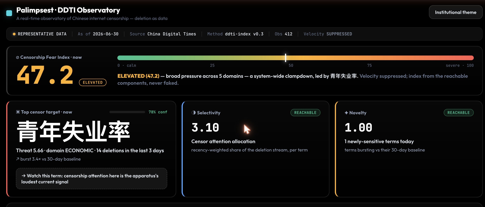
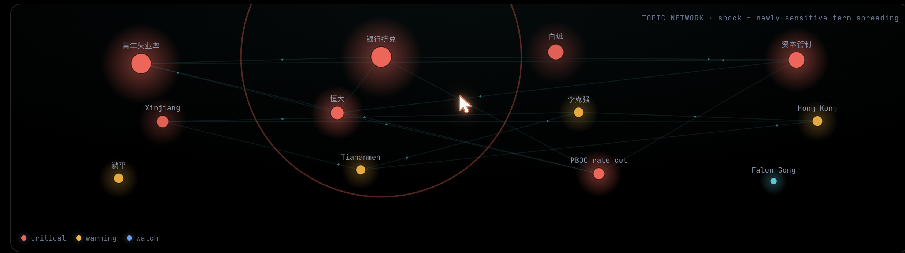

# Palimpsest


**An open-source observatory that measures Chinese internet censorship by treating
deletion itself as data.**

Palimpsest archives public Chinese posts and news, watches for when they are scrubbed,
and turns what the state is burying into a free, openly licensed early-warning signal
for journalists, researchers, and human rights defenders.

It is built entirely from open sources. **The thing it watches is the censor, never the
censored.**

> **Try it in ten seconds — no install, no key, no database:**
> ```bash
> python3 demo/palimpsest_demo.py
> ```
> Pulls the live China Digital Times feed, ranks what the censor is most focused on
> right now, and writes a dashboard. (`--source sample` runs an offline, deterministic
> demo.) See [`demo/`](demo/).
>
> **Or open the full observatory** (no install): open
> [`dashboards/ddti_observatory.html`](dashboards/ddti_observatory.html) — the Fear Index,
> the selectivity/novelty signals, the topic network with censorship-shock propagation, a
> temporal index with a forward projection, and velocity shown *fail-loud* where in-China
> measurement is still required.



> *The observatory headline: the Censorship Fear Index (one auditable 0–100 number), the top
> censor target, and the reachable selectivity and novelty signals. Velocity is shown
> suppressed, never faked. Representative data.*

---

## Why this exists

Chinese internet censorship has quietly become invisible. Before roughly 2013 a deletion
often left a mark you could see and count. Today it usually does not: a post simply stops
existing, with no notice and nothing left behind. For the people this hurts most —
journalists who cover China, human rights defenders, and activists in the diaspora — that
silence is the point. They tend to learn a topic was dangerous only after a contact is
detained or a thread disappears.

Censorship is also one of the clearest readings of what an authoritarian state actually
fears, and almost nobody can read it in real time. What a government rushes to delete
reveals what it is most worried about. Every deletion is a kind of confession. Palimpsest
turns those confessions into a continuous, quantified, openly licensed signal.

## Where Palimpsest sits in the OSINT ecosystem

There is a healthy ecosystem of China OSINT, but it has a hole in the middle. Measurement
projects such as [OONI](https://ooni.org/), [GreatFire](https://en.greatfire.org/), and
[Citizen Lab](https://citizenlab.ca/) probe *network-layer* blocking. Newsrooms and
[China Digital Times](https://chinadigitaltimes.net/) document deletions by hand.

**Palimpsest fills the gap none of them target: continuous, quantified measurement of
content-layer censorship — what gets deleted, how selectively, how fast, and what is newly
sensitive.** It is designed to complement these projects, ingest their public data, and
share its own back, not to duplicate them.

## The method: treat the censor as a sensor

Palimpsest archives a public post the moment it appears, then comes back later to check
whether it is still there. From the stream of disappearances it computes the
**Deletion-Differential Threat Index (DDTI)**:

| Signal | Question it answers |
| --- | --- |
| **Selectivity** | What is being targeted — which terms and topics draw censor attention. |
| **Novelty** | Which sensitive terms are surfacing for the first time, or bursting after being quiet. |
| **Velocity** | How fast posts are being deleted. A sudden acceleration signals an event being contained. |

The full method, its math, and its honest limits are in [docs/METHODOLOGY.md](docs/METHODOLOGY.md).



> *The live topic network: each node a censored topic, sized by threat; the ring is a
> censorship shock spreading across newly-sensitive terms.*

## Validated against real events

The method is **backtested by retrodiction** — run against documented censorship events the
way a quantitative signal is backtested against history. Across six events (Li Wenliang,
Peng Shuai, the Sitong Bridge protest, the White Paper protests, and more) the scorer ranks
the correct term **first** every time, flags euphemisms *born in the event* as novel, and
surfaces them from only a handful of deletions. Reproduce it:

```bash
PYTHONPATH=. python3 scripts/validate_ddti.py
```

See [docs/VALIDATION.md](docs/VALIDATION.md) — including the Sitong Bridge worked example and
the honest boundary cases.

## One number: the Censorship Fear Index

The DDTI distils into a single, auditable **0–100 Fear Index** — *how hard is the state
working to bury things right now?* It separates a calm baseline from an acute containment
event from a system-wide clampdown, and reports every component transparently (never a black
box). It is the signal a journalist or citizen can read at a glance. Run
`PYTHONPATH=. python3 scripts/fear_index_demo.py` to see it spike across the documented events.

## It generalises beyond China

The method is country-agnostic; what changes per authoritarian information space is the
*lexicon*. China ships today; **Iran loads from config alone** (the Woman-Life-Freedom-era
starter lexicon). Adding a country is a gazetteer plus a registry entry, not a rewrite —
see [`config/regions/`](config/regions/).

## What's in the platform

```
 COLLECT          →   DETECT          →   MEASURE         →   DISCOVER        →   PUBLISH
 multi-source         archive / probe     DDTI index           self-evolving       Fear Index
 public OSINT         from many           (selectivity,        euphemism           observatory
 (CDT, GreatFire,     vantages,           novelty, velocity)   gazetteer +         open dataset
  Weibo, GDELT)       confirm deletion    + cross-signal       forecaster
  + UNDERTEXT         + divergence            ↑___________________________|
  + Airport Carto.    + airport diffs      GOVERNANCE: kill-switch · rate ceiling · hash-chained audit
```

## What is built, and what is not

| Component | State |
| --- | --- |
| CDT deletion ingestion + DDTI (selectivity + novelty) | Running |
| **Censorship Fear Index** (one auditable number) | Built, tested |
| **Retrodiction validation** (6/6 documented events) | Built, tested |
| **Cross-region packs** (China + Iran, config-driven) | Built, tested |
| **Censorship forecaster** (escalation + euphemism prediction) | Built, tested |
| Evidence-grounded Chinese gazetteer (154 terms, phylogeny) | Built, tested |
| GDELT cross-signal · UNDERTEXT tomography · Airport Cartography | Built, tested |
| **Generative Firewall** — refusal / party-line tomography of state-aligned LLMs | Built, tested (Layer-1 local + deterministic; Layer-2 stream-scrub gated, inert) |
| **CDN-Edge Differential** — geo-fork of content read off overseas cache POPs | Built, tested (edge-fetch injected, inert) |
| **Blocklist Archaeology** — newly-added terms in client blocklists as novelty | Built, tested (published lists only; acquisition injected) |
| **Silence Detection** — the coverage-hole left by a pre-emptive blackout | Built, tested (outside-the-wall domestic-volume feed injected) |
| **GitHub-as-Refuge** — pressure on censored mirrors, from takedown transparency feeds | Built, tested (GitHub reads injected, inert) |
| **Baike Redaction-Diff** — state-encyclopedia rewrites vs the open record | Built, tested (fetch injected, inert) |
| Self-evolving euphemism gazetteer (human-ratified) | Built, tested |
| Governance: kill-switch, rate ceiling, hash-chained audit | Built, tested |
| Deletion detector — LIVE / GONE / UNKNOWN / DEGRADED state machine | Built, 34 tests |
| Zero-dependency public demo | Built |
| Real-time velocity at minute resolution | Needs in-country / seam measurement |

The honest blocker: selectivity and novelty work today, while velocity is blocked from
outside China because the relevant feeds are walled to foreign traffic. The method that
closes it — **UNDERTEXT** many-vantage differential observation, where disagreement between
vantage points *is* the censorship signal — is built and tested here
(`collectors/undertext.py`); what scaling adds is the in-country / seam *vantage backends*.
See [docs/UNDERTEXT.md](docs/UNDERTEXT.md).

**Six new observation surfaces** extend the same UNDERTEXT tensor — a finding is just a new
`surface` in `observation = f(query × geo × cohort × surface × time)`, and each maps into the
*existing* DDTI selectivity/novelty index unchanged. The **Generative Firewall** interrogates
state-aligned LLMs (a refusal is a deletion; a mid-stream token wipe is the velocity signal the
web legs cannot reach). The **CDN-Edge Differential** reads geo-forked content off overseas cache
POPs. **Blocklist Archaeology** diffs the censor's own client-shipped keyword lists (the cleanest
novelty signal — the term is pre-labelled for us). **Silence Detection** measures the
coverage-*hole* a pre-emptive blackout leaves when there is no 404 to count. **GitHub-as-Refuge**
watches takedown-transparency feeds for pressure on censored mirrors. **Baike Redaction-Diff**
reconstructs a state encyclopedia's hidden rewrites against the open record. Every one holds both
safety lines (public reads only; no Beijing-aligned model is ever the analyst) and stays inert
until a deployer injects a live source. Full method write-ups are in
[docs/NEW-METHODS.md](docs/NEW-METHODS.md).

## Safety is the architecture

See [SAFETY.md](SAFETY.md) and [docs/ETHICS.md](docs/ETHICS.md). In short: public data only;
nobody inside China is ever asked to act; a deletion is never claimed lightly (the detector
probes a known-live control post first each cycle and suppresses all deletion writes when the
network is unreliable); the sensitive-terms gazetteer is human-authored and never delegated to
a Beijing-aligned model; and every figure ships with its uncertainty and known biases stated
openly. Those rules are enforced in code (`core/governance.py`), not just documented.

## Running it

```bash
# Zero-dependency demos (recommended first run) — no venv needed:
python3 demo/palimpsest_demo.py                 # live CDT pull + ranking
python3 demo/palimpsest_demo.py --source sample # offline deletion demo

# Pure, offline cores (no database):
PYTHONPATH=. python3 scripts/validate_ddti.py       # retrodiction backtest (6/6 events)
PYTHONPATH=. python3 scripts/fear_index_demo.py      # Fear Index across documented events
PYTHONPATH=. python3 scripts/forecaster_demo.py      # the censorship forecaster (a "called shot")
PYTHONPATH=. python3 processors/gazetteer_evolution.py   # discovers a new euphemism from samples
PYTHONPATH=. python3 core/governance.py              # kill-switch + audit-chain demo

# Tests:
python3 -m venv .venv && source .venv/bin/activate && pip install -r requirements.txt
PYTHONPATH=. python3 -m pytest tests/ -q             # pure/offline cores (62 passing)
```

The live velocity leg needs PostgreSQL, Redis, and in-country / seam egress; see
`censorwatch/DEPLOY.md`. It stays inert unless `CENSORWATCH_ENABLED` is set.

## Documentation

| Document | What it covers |
| --- | --- |
| [docs/METHODOLOGY.md](docs/METHODOLOGY.md) | The DDTI method, the math, and its honest scope and biases |
| [docs/VALIDATION.md](docs/VALIDATION.md) | Retrodiction backtest — does the method catch documented events? |
| [docs/VISION.md](docs/VISION.md) | Palimpsest as a measurement commons for content-layer censorship |
| [docs/UNDERTEXT.md](docs/UNDERTEXT.md) | Active differential tomography — many-vantage divergence as signal |
| [docs/NEW-METHODS.md](docs/NEW-METHODS.md) | Six new observation surfaces (Generative Firewall, CDN-edge, Blocklist, Silence, GitHub-refuge, Baike) — method, DDTI mapping, safety |
| [docs/PAPER-OUTLINE.md](docs/PAPER-OUTLINE.md) | "Deletion as Data" — the research write-up plan |
| [docs/OSINT_SOURCES.md](docs/OSINT_SOURCES.md) | Every public source, how it's accessed, what it yields, its limits |
| [docs/ETHICS.md](docs/ETHICS.md) | Threat model, do-no-harm rules, and why the platform is OSINT-only |
| [SAFETY.md](SAFETY.md) · [CONTRIBUTING.md](CONTRIBUTING.md) | Source protection, the hard rules, and the safety-review gate |

## Status and license

Working prototype, developed in the open as a public good. Free and open-source; it is not a
commercial product and never monetizes the people or topics it observes. Licensed under the
[MIT License](LICENSE) so other tools can freely build on the feed and reuse the measurement layer.

## Acknowledgements and prior art

Palimpsest is built to complement, not repeat, the work of China Digital Times, GreatFire,
Citizen Lab, and OONI. It ingests CDT deletion data as one input and is designed to share its
data back. It draws on the academic measurement tradition of WeiboScope and the deletion-speed
studies of Zhu et al. (2013) and Bamman et al. (2012), whose decade-old figures it re-measures
rather than assumes.
