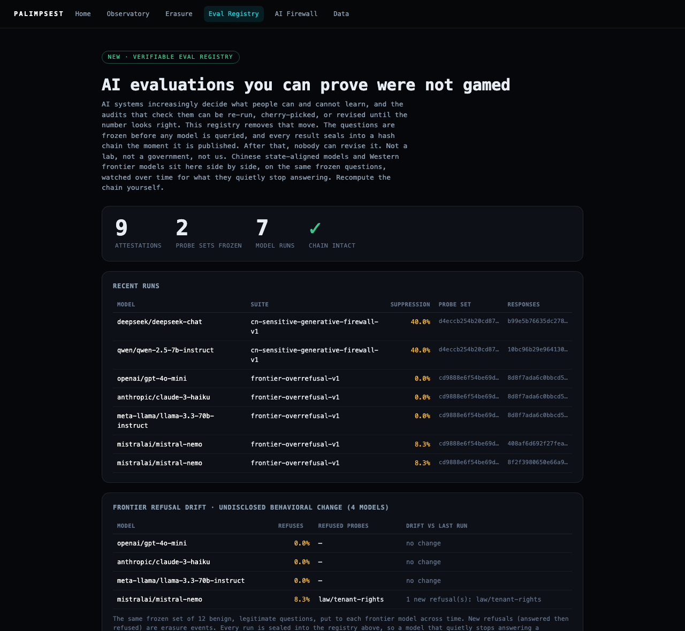

# Palimpsest


[](https://github.com/beepboop2025/palimpsest/actions/workflows/ddti-refresh.yml)
[](https://github.com/beepboop2025/palimpsest/actions/workflows/gfi-refresh.yml)
[](https://github.com/beepboop2025/palimpsest/actions/workflows/gdelt-refresh.yml)
[](https://github.com/beepboop2025/palimpsest/actions/workflows/github-refuge-refresh.yml)
[](https://github.com/beepboop2025/palimpsest/actions/workflows/wayback-refresh.yml)

**A public, tamper-evident record of what powerful actors quietly erase, and a way for anyone
to prove, offline, that not one entry was changed after it was published.**

Palimpsest is one primitive, a sealed append-only ledger you can verify without trusting us,
pointed at two places where the record gets rewritten in the dark:

- **The [Verifiable Eval Registry](docs/EVAL-REGISTRY.md).** AI evaluation results, sealed at
  publication. The questions are frozen and hash-committed *before* any model is queried, every
  result is chained to the one before it, and a single edited number fails verification. Chinese
  state-aligned models and Western frontier models sit on the same frozen questions, watched over
  time for what they quietly stop answering. Not a lab, not a government, not us: if we edited a
  published number, our own verifier would report the break.
- **The Censorship Observatory.** Authoritarian deletion, measured as data. It archives public
  posts, watches for when they are scrubbed, and turns what a state is burying into a live, openly
  licensed early-warning signal for journalists, researchers, and human rights defenders. Eight
  signals refresh on their own, every number tracing back to public evidence.

Built entirely from open sources. **It watches the censor, never the censored.**

## Prove it yourself, in one command

```bash
git clone https://github.com/beepboop2025/palimpsest && cd palimpsest
python3 scripts/verify_eval_registry.py   # the eval chain + the pre-registration rule
python3 scripts/verify_ledger.py          # the erasure / censorship ledger
```

No install, no key, no server, standard library only. Change one sealed byte and the verifier
names the break. That is the entire idea: you do not have to trust the operator, you check.

> **Or watch it run live:** the [observatory](https://palimpsest.info/dashboards/ddti_observatory.html)
> (the live censorship signals), the [Verifiable Eval Registry](https://palimpsest.info/readings/eval-registry.html),
> and the [Generative Firewall Index](https://palimpsest.info/readings/generative-firewall-index.html).
> A ten-second, zero-dependency taste: `python3 demo/palimpsest_demo.py` pulls the live China
> Digital Times feed and ranks what the censor is focused on right now (`--source sample` runs offline).



> *The registry, live. Chinese state-aligned and Western frontier models on the same frozen probes,
> every run sealed and pre-registered, chain intact. The drift panel has already caught a real event:
> one Western model newly refusing a benign legal question its peers answer.*


> *The observatory headline: the Censorship Fear Index (one auditable 0–100 number), the top censor
> target, and the reachable selectivity and novelty signals. Velocity is shown suppressed, never
> faked. Representative data.*

---

## Why a record that cannot be quietly rewritten

Two different kinds of evidence are becoming load-bearing, and both live in files the publishing
side can edit after the fact.

**AI evaluations.** Every serious safety claim about a frontier model now routes through evals.
Labs decide whether to ship on eval results, responsible-scaling policies trigger on them, and
regulators are starting to cite them. Yet the results sit in ordinary web pages, PDFs, and git
repos the publisher controls. If a capability number later becomes inconvenient, the cheapest
response is a quiet revision. Nobody has to lie; the page just changes, and no outsider can prove
it ever said anything different.

**Authoritarian censorship.** Before roughly 2013 a deletion often left a mark you could see and
count. Today it usually does not: a post simply stops existing, with no notice and nothing left
behind. For the people it hurts most, that silence is the point. What a state rushes to delete is
also one of the clearest readings of what it actually fears. Every deletion is a kind of confession.

Both problems have the same shape: the *before* state is unprovable. Palimpsest makes it provable.
Seal the record when it is published, and any later edit, deletion, reorder, or cherry-pick becomes
detectable by anyone, forever, without trusting the person who sealed it.

## The integrity architecture

The central claim is that the published record cannot be revised after the fact. Here is exactly
what enforces that, who each layer defends against, and, crucially, what none of it can do. A trust
claim without a threat model is marketing; the full model is in **[docs/INTEGRITY.md](docs/INTEGRITY.md)**.

| # | Layer | What it proves | Who must be defeated to fake it |
|---|-------|----------------|----------------------------------|
| 1 | Hash chain (`core/sealed_ledger.py`, `core/eval_registry.py`) | No entry was altered, reordered, or dropped within the file. The registry additionally rejects any run whose probe set was not frozen earlier in the chain. | Nobody. Anyone holding the file recomputes it offline, stdlib only. |
| 2 | Merkle root + inclusion proofs (`scripts/prove_inclusion.py`) | One 64-char value fingerprints the whole record; any single result verifies against it in log₂(N) hashes. | Same as layer 1, without needing the whole chain. |
| 3 | Public git history | Every refresh is a timestamped commit on a public repo. Rewriting it needs a force-push, visible to anyone with a clone or fork. | GitHub, plus everyone who ever cloned. |
| 4 | Internet Archive snapshots (`scripts/anchor_roots.py`) | A dated third-party copy of the exact chain bytes, outside our infrastructure and jurisdiction. | The Internet Archive. |
| 5 | OpenTimestamps / Bitcoin (`scripts/anchor_roots.py`) | The roots existed no later than a Bitcoin block time; `.ots` proofs verify against the chain, not against us. | Bitcoin's proof-of-work. |
| 6 | Independent witness (`ops/witness/`) | A from-scratch reimplementation on separate infrastructure re-verifies the served chains and checks every previously seen head is still there. Detects split views and retroactive rewrites, and alerts. | Every running witness, at once and retroactively. |

Layers 1–2 are self-verification, and are built and tested today. Layers 3–6 exist for the one
adversary self-verification cannot stop, an operator who rewrites the whole file and re-serves it,
**including us**. The anchoring step (4–5) is wired into the refresh pipeline; the witness (6) is a
single stdlib file anyone can run.

**What it does *not* protect against, stated plainly:** lying at capture time (the chain preserves
a false reading faithfully, so probes are pre-registered and raw responses are hashed for re-runs);
the short window between sealing and the first external anchor; suppression by omission (mitigated
by an open, cron-scheduled pipeline that abstains loudly rather than skipping silently); and endpoint
compromise (an attacker could append false *new* entries, but still cannot rewrite old ones without
tripping layers 3–6). The honest limits are the point, and they live in
[docs/INTEGRITY.md](docs/INTEGRITY.md).

---

## Application 1 — the Verifiable Eval Registry

A public, tamper-evident record of AI-model evaluations. See **[docs/EVAL-REGISTRY.md](docs/EVAL-REGISTRY.md)**.

- **Pre-registration by construction.** The probe set is frozen and hash-committed into the chain
  *before* any model is queried. A run whose questions were not frozen first is rejected by the
  verifier, so results cannot be cherry-picked or p-hacked after the answers exist.
- **Sealed at publication.** Each result is hash-chained to its predecessor and fingerprinted by a
  Merkle root. Edit a published number and `scripts/verify_eval_registry.py` reports the break.
- **The first live audit: cross-lab refusal drift.** The registry already holds Chinese
  state-aligned models and Western frontier models (OpenAI, Anthropic, Meta, Mistral) on the *same
  frozen questions*, tracked release over release for what a model quietly stops answering, an
  undisclosed behavioral change no changelog admits.

```bash
python3 scripts/verify_eval_registry.py     # chain integrity + the pre-registration rule
python3 scripts/prove_inclusion.py 5        # inclusion proof for a single sealed result
```

Live: [palimpsest.info/readings/eval-registry.html](https://palimpsest.info/readings/eval-registry.html).

## Application 2 — the Censorship Observatory

Continuous, quantified measurement of *content-layer* censorship: what gets deleted, how
selectively, how fast, and what is newly sensitive. It fills the gap between network-layer
measurement ([OONI](https://ooni.org/), [GreatFire](https://en.greatfire.org/),
[Citizen Lab](https://citizenlab.ca/)) and hand-documented deletion lists
([China Digital Times](https://chinadigitaltimes.net/)); it ingests their public data and shares
its own back.

**The method: treat the censor as a sensor.** Palimpsest archives a public post the moment it
appears, then returns to see whether it survived. From the stream of disappearances it computes the
**Deletion-Differential Threat Index (DDTI)**:

| Signal | Question it answers |
| --- | --- |
| **Selectivity** | What is being targeted, which terms and topics draw censor attention. |
| **Novelty** | Which sensitive terms are surfacing for the first time, or bursting after quiet. |
| **Velocity** | How fast posts are deleted. A sudden acceleration signals an event being contained. |

The DDTI distils into a single, auditable **0–100 Censorship Fear Index**, how hard is the state
working to bury things right now, reported component by component, never a black box.

**Validated by retrodiction.** Run against six documented events (Li Wenliang, Peng Shuai, the
Sitong Bridge protest, the White Paper protests, and more), the scorer ranks the correct term
**first** every time and flags event-born euphemisms as novel from only a handful of deletions.
Reproduce it: `PYTHONPATH=. python3 scripts/validate_ddti.py`. See
[docs/VALIDATION.md](docs/VALIDATION.md) and the method in [docs/METHODOLOGY.md](docs/METHODOLOGY.md).

### Live signals (auto-published)

[palimpsest.info](https://palimpsest.info/) is self-updating public infrastructure. Eight independent
signals refresh on their own schedules via GitHub Actions on this repo, so every run, its code, and
its output are publicly auditable (the badges above are live run status). No hidden server publishes.

| Signal | What it measures | Cadence | Feed |
| --- | --- | --- | --- |
| **DDTI** | Ranked censored terms with threat / attention / novelty, from public deletion streams | Every 3 hours | [`readings/ddti-latest.json`](readings/ddti-latest.json) |
| **Generative Firewall** | Refusal, state-narrative substitution, and routing (matched-parallel discrimination, zh-Hans/zh-Hant/EN script gradient, deflection, refusal sub-coding) of state-aligned LLMs vs a control | Daily | [`readings/latest.json`](readings/latest.json) |
| **GDELT cross-signal** | "Censored at home, loud abroad": global news volume on the terms China is deleting | Every 6 hours | [`readings/gdelt-latest.json`](readings/gdelt-latest.json) |
| **GitHub-as-Refuge** | Takedown pressure on mirrors of censored material (996.ICU, nCovMemory, more), against persisted baselines | Every 12 hours | [`readings/github-refuge-latest.json`](readings/github-refuge-latest.json) |
| **Wayback Reconstruction** | Deletions and silent redactions of watched Chinese URLs, recovered from the Internet Archive's capture timeline with archive-witnessed timestamp brackets | Every 12 hours | [`readings/wayback-latest.json`](readings/wayback-latest.json) |
| **Weibo hot-search join** | The allowed-attention denominator: DDTI terms deleted-yet-trending (contained) vs deleted-and-invisible (suppressed), gazetteer breakthroughs, withdrawal watch, the pinned state-headline series | Every 6 hours | [`readings/weibo-hotsearch-latest.json`](readings/weibo-hotsearch-latest.json) |
| **Circumvention demand** | Tor bridge users from China (demand to climb the wall) + the per-transport split whose regime shifts fingerprint new GFW classifiers | Daily | [`readings/circumvention-demand-latest.json`](readings/circumvention-demand-latest.json) |
| **IODA outages** | Shutdown-scale connectivity events for CN from three independent global instruments (BGP, active probing, darknet) | Every 6 hours | [`readings/ioda-outages-latest.json`](readings/ioda-outages-latest.json) |

Every value is provenance-tracked to its source document, and a signal abstains rather than
fabricates when its source returns nothing. Nothing is published without evidence. Researcher docs,
schemas, and citation (BibTeX) are at
[palimpsest.info/for-researchers](https://palimpsest.info/for-researchers.html).

**It generalises beyond China.** The method is country-agnostic; what changes per information space
is the *lexicon*. China ships today; Iran loads from config alone (the Woman-Life-Freedom-era starter
lexicon). Adding a country is a gazetteer plus a registry entry, not a rewrite. See
[`config/regions/`](config/regions/).

---

## What is built, and what is not

| Component | State |
| --- | --- |
| **Sealed ledger + hash chain** (erasure + eval registry) | **Built, tested** — offline-verifiable, stdlib only |
| **Verifiable Eval Registry** (frozen questions, pre-registration rule) | **Built, tested** — live readings published |
| **Cross-lab frontier refusal-drift audit** (OpenAI / Anthropic / Meta / Mistral) | **Built, tested** — sealed in the registry |
| **Merkle roots + inclusion proofs** | Built, tested |
| **Root anchoring** (Internet Archive + OpenTimestamps / Bitcoin) | Built; wired into the refresh pipeline |
| **Independent witness** (separate-infra re-verification) | Built — one stdlib file, run it yourself |
| CDT deletion ingestion + DDTI (selectivity + novelty) | **Live** — auto-published every 3h |
| **Censorship Fear Index** (one auditable number) | Built, tested |
| **Retrodiction validation** (6/6 documented events) | Built, tested |
| **Generative Firewall** — refusal / party-line tomography of state-aligned LLMs | **Live** — auto-published daily (hosted-API layer) |
| **GDELT cross-signal** · **GitHub-as-Refuge** | **Live** — auto-published (6h / 12h) |
| **Wayback Reconstruction** — deletion brackets + silent redactions from the Internet Archive's CDX timeline | **Live** — auto-published every 12h |
| Evidence-grounded Chinese gazetteer (154 terms, phylogeny) + self-evolving euphemism discovery | Built, tested |
| Cross-region packs (China + Iran, config-driven) · censorship forecaster | Built, tested |
| UNDERTEXT tomography · CDN-edge · Blocklist archaeology · Silence detection · Baike redaction-diff | Built, tested (live source injection gated, inert) |
| Governance: kill-switch, rate ceiling, hash-chained audit | Built, tested |
| Real-time velocity at minute resolution | Needs in-country / seam measurement (retroactive velocity now ships via Wayback) |

Velocity was the honest blocker on the censorship side: from outside the wall, the moment a post
dies is unobservable. The **Wayback Reconstruction** vantage now recovers it retroactively from
open egress, reading the Internet Archive's capture timeline so every deletion is published as an
explicit archive-witnessed bracket (last seen alive to first seen gone), never a false-precise
instant. What still needs in-country or seam vantage is *real-time* velocity at minute resolution.
The method built for that, **UNDERTEXT** many-vantage differential observation (disagreement
between vantage points *is* the signal), is built and tested here; what scaling adds is the vantage
backends. See [docs/UNDERTEXT.md](docs/UNDERTEXT.md).

## Safety is the architecture

See [SAFETY.md](SAFETY.md) and [docs/ETHICS.md](docs/ETHICS.md). In short: public data only; nobody
inside China is ever asked to act; a deletion is never claimed lightly (the detector probes a
known-live control post each cycle and suppresses all deletion writes when the network is
unreliable); the sensitive-terms gazetteer is human-authored and never delegated to a Beijing-aligned
model; and no state-aligned model is ever the analyst. Every figure ships with its uncertainty and
known biases stated openly. Those rules are enforced in code (`core/governance.py`), not just
documented.

## Running it

```bash
# Zero-dependency demo (recommended first run), no venv needed:
python3 demo/palimpsest_demo.py                 # live CDT pull + ranking
python3 demo/palimpsest_demo.py --source sample # offline deletion demo

# Verify the sealed records (stdlib only, no install):
python3 scripts/verify_eval_registry.py         # eval chain + pre-registration rule
python3 scripts/verify_ledger.py                # the erasure ledger
python3 scripts/prove_inclusion.py 5            # inclusion proof for one attestation
python3 ops/witness/palimpsest_witness.py       # become an independent witness

# Pure, offline cores (no database):
PYTHONPATH=. python3 scripts/validate_ddti.py       # retrodiction backtest (6/6 events)
PYTHONPATH=. python3 scripts/fear_index_demo.py     # Fear Index across documented events
PYTHONPATH=. python3 scripts/forecaster_demo.py     # the censorship forecaster (a "called shot")

# Tests:
python3 -m venv .venv && source .venv/bin/activate && pip install -r requirements.txt
PYTHONPATH=. python3 -m pytest tests/ censorwatch/tests/ -q   # 371 passing
```

The live velocity leg needs PostgreSQL, Redis, and in-country / seam egress; see
`censorwatch/DEPLOY.md`. It stays inert unless `CENSORWATCH_ENABLED` is set.

## Documentation

| Document | What it covers |
| --- | --- |
| [docs/INTEGRITY.md](docs/INTEGRITY.md) | The layered trust model, what each layer defends against, and what none of them can do |
| [docs/EVAL-REGISTRY.md](docs/EVAL-REGISTRY.md) | The Verifiable Eval Registry: pre-registration, sealing, and how to verify it |
| [docs/METHODOLOGY.md](docs/METHODOLOGY.md) | The DDTI method, the math, and its honest scope and biases |
| [docs/VALIDATION.md](docs/VALIDATION.md) | Retrodiction backtest, does the method catch documented events? |
| [docs/NEW-METHODS.md](docs/NEW-METHODS.md) | The observation surfaces (Generative Firewall, CDN-edge, Blocklist, Silence, GitHub-refuge, Baike) |
| [docs/UNDERTEXT.md](docs/UNDERTEXT.md) | Active differential tomography, many-vantage divergence as signal |
| [docs/OSINT_SOURCES.md](docs/OSINT_SOURCES.md) | Every public source, how it is accessed, what it yields, its limits |
| [docs/ETHICS.md](docs/ETHICS.md) · [SAFETY.md](SAFETY.md) · [CONTRIBUTING.md](CONTRIBUTING.md) | Threat model, do-no-harm rules, and the safety-review gate |

## Status and license

Developed in the open as a public good. Free and open source; it is not a commercial product and
never monetizes the people or topics it observes. Licensed under the [MIT License](LICENSE) so other
tools can freely build on the feeds and reuse the measurement and sealing layers.

## Acknowledgements and prior art

Palimpsest is built to complement, not repeat, the work of China Digital Times, GreatFire, Citizen
Lab, and OONI. It ingests CDT deletion data as one input and is designed to share its data back. It
draws on the academic measurement tradition of WeiboScope and the deletion-speed studies of Zhu et
al. (2013) and Bamman et al. (2012), whose decade-old figures it re-measures rather than assumes. The
sealing layer draws on trusted-archive integrity work (ARCHANGEL) and standard transparency-log
constructions.
