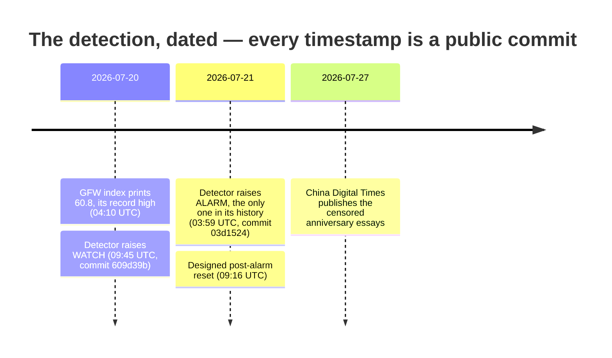

# Detections — what this instrument has actually caught

An observatory that never says what it found is a dashboard. This file is the
opposite commitment: a short, dated record of the things the instrument surfaced,
written so that a hostile reader can check every one of them against published
files and public reporting.

The rule for this page is that a claim earns its place only if the evidence
predates the confirmation and sits in a public commit. Where the link is timing
rather than proven causality, it says so in the entry, not in a footnote.

Read [INTEGRITY.md](INTEGRITY.md) for why the timestamps below cannot be quietly
moved, and [METHODOLOGY.md](METHODOLOGY.md) for how the indices are built.

---

## 1. The Zhengzhou flood anniversary, 20 to 21 July 2026

**What the instrument did.** On 20 July 2026 the network-layer GFW index reached
60.8, the highest value in its recorded history. The conformal change detector
raised `watch` at 09:45 UTC that day and escalated to `alarm` at 03:59 UTC the
next morning. That is the only `alarm` this detector has produced across its
entire history.

**What 20 July is.** The fifth anniversary of the 2021 Zhengzhou floods, in which
398 people died in Henan province. Coverage of the disaster, and of the state's
handling of it, was heavily censored at the time.

**What arrived afterwards.** On 27 July 2026, seven days later, China Digital
Times published its documentation of that week's censored anniversary essays.



### The evidence

| What | Where | Value |
| --- | --- | --- |
| Index record high | `readings/ooni-gfw-history.jsonl` | `60.8` at `2026-07-20T04:10`, against a 90-reading range of 55.1 to 60.8 |
| Detector raised watch | `readings/event-flags-history.jsonl` | `2026-07-20T09:45:28Z`, commit `609d39b` |
| Detector raised alarm | `readings/event-flags-history.jsonl` | `2026-07-21T03:59:30Z`, commit `03d1524` |
| Alarms ever produced | `readings/event-flags-latest.json` | `n_alarms_in_history: 1` |
| Most anomalous domain | `readings/ooni-gfw-history.jsonl` | `www.bbc.com`, first appearing at `2026-07-20T04:10`, previously `globalvoices.org` |

### Why the alarm is not a tuned threshold

The detector is a Shiryaev-Roberts e-detector over a conservative rank-based
p-value, with the flag levels fixed at `WATCH >= 100` and `ALARM >= 500`. Its
stated guarantee is anytime-valid: under no change, the average number of readings
before a false alarm is at least 500. It is designed to be looked at every six
hours forever without inflating its own false-alarm rate, which is the property a
fixed-n significance test re-run on a schedule does not have.

It has produced one alarm in ninety readings.

### Why the index could not be inflated by an artefact

`gfw_index` is a measurement-weighted anomaly **rate**, computed as
`100 * total_anomalies / total_valid` over a rolling window, not a count of
anomalies. A fall in measurement volume therefore cannot mechanically raise it.
Measurement volume did dip slightly that day; the rate rose anyway.

### What this is not

- **The flag is network-layer. The CDT evidence is content-layer.** One measures
  reachability, the other documents deleted essays. The anniversary is the link
  between them. This entry does not claim the index predicted the specific
  articles CDT later published, and nothing here establishes causality.
- **The BBC was already blocked.** It is chronically blocked in China. The finding
  is that it became the *most anomalous* domain in the panel that week, not that
  it was newly blocked. The `top_blocked` field has only been recorded since
  11 July 2026, so "first time" is bounded by that window.
- **This is one observation.** n=1. A single dated alarm ahead of a single public
  confirmation is not a validated predictive record, and this page will not
  present it as one. It is the first entry, and the honest way to read it is as a
  demonstration that the machinery produces dated, checkable claims, not as an
  established hit rate.
- The detector returned to `warming_up` at 09:16 UTC on 21 July. That is the
  designed post-alarm reset of the statistic and its reference window, not a
  retraction of the alarm.

### Why the dating holds

The detection is a commit in a public repository, made six days before the
confirming article existed. `main` carries a ruleset that blocks force pushes and
branch deletion, so the history can only grow. Every reading is also hash-chained
at capture and committed by a Merkle root, and the roots are anchored externally
to the Internet Archive and, via OpenTimestamps, to Bitcoin. Verify it from a
clean clone:

```
python3 scripts/verify_ledger.py                 # recompute the whole chain
python3 scripts/prove_inclusion.py 1 > proof.json # a Merkle proof for one entry
python3 scripts/prove_inclusion.py --check proof.json
git log -1 --format='%H %cI' 609d39b             # the watch, dated
git log -1 --format='%H %cI' 03d1524             # the alarm, dated
```

The proof is self-contained JSON: fold the path from `entry_hash`, hashing each
sibling on the stated side, and compare against `merkle_root`. Checking it needs
nothing from this repository.

That is the whole argument this project makes about itself. The claim is not
"trust the operator". It is that the operator cannot quietly move the record
either.

---

## 2. A silent redaction on China's National Bureau of Statistics, reconstructed

**What the instrument did.** On its first run the Wayback Reconstruction signal
found the NBS "latest releases" page had been silently edited between two archive
captures on 16 March 2023, and bracketed the edit to 3,341 seconds, about 56
minutes. Both snapshot URLs are preserved in the reading. The same run logged 40
further archive-witnessed mutations on that page through June 2026.

**Why that page.** It is the release surface for the youth unemployment series
that the NBS stopped publishing in August 2023, after the figure reached a record
21.3 percent. The suspension was reported worldwide.

**Evidence.** `readings/wayback-history.jsonl`, first row; `readings/wayback-latest.json`
at commit `7845542`, `generated_at 2026-07-11T20:00:25Z`.

### What this is not

This is archaeology, not real-time detection. The edit happened in 2023 and was
reconstructed in 2026 from the Internet Archive's timeline. It demonstrates that
minute-level bracketing of a silent government edit is achievable from outside the
firewall using only public archives. It does not demonstrate that this instrument
saw it happen. Watching edits at that resolution as they occur is what in-country
vantage coverage is for, and that is not yet funded.

---

## How to add an entry here

An entry needs: a dated artefact in a published file, a commit that predates any
external confirmation, a plain statement of what the instrument observed, and an
explicit section saying what the finding does not establish. If the last part is
hard to write honestly, the entry is not ready.

Null results belong here too. A detector that only ever reports its hits is
telling you about its author, not about China.
