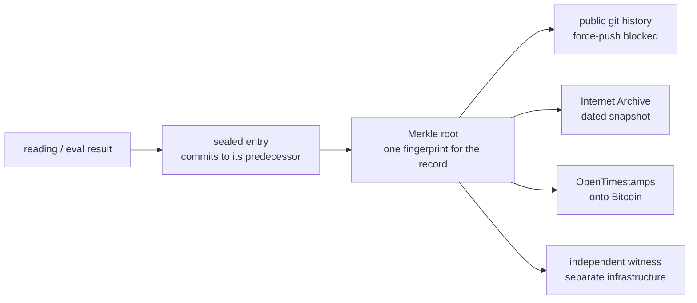

# Integrity architecture and threat model

Palimpsest's central claim is that its published record cannot be revised
after the fact. This document says exactly what enforces that, layer by
layer, who each layer defends against, and what none of them can do. A trust
claim without a threat model is marketing; this is the threat model.



A value edited after sealing breaks every hash link to its right, and each box in
the bottom row is held by someone who is not us. The table below says exactly what
each layer proves and who would have to be defeated to fake it.

## The layers

| # | Layer | What it proves | Who has to be defeated to fake it |
|---|-------|----------------|-----------------------------------|
| 1 | Hash chain (`core/sealed_ledger.py`, `core/eval_registry.py`) | No entry was altered, reordered, or dropped *within* the file as served. Every entry commits to its predecessor; the registry additionally rejects any run whose probe set was not frozen earlier in the chain. | Nobody. Anyone who holds the file can recompute it offline, stdlib only. |
| 2 | Merkle root + inclusion proofs (`scripts/prove_inclusion.py`) | One 64-char value fingerprints the whole record; any single attestation can be checked against it with log2(N) hashes. | Same as layer 1, but a verifier no longer needs the whole chain. |
| 3 | Public git history | Every refresh is a timestamped commit on a public repository. Force-pushes and branch deletion on main are blocked by an active repository ruleset with no bypass actors ("history-can-only-grow"), so rewriting served history first requires visibly changing the rules; and any rewrite would still be visible to anyone with a clone, a fork, or a fetched ref. | GitHub, plus everyone who ever cloned or forked. |
| 4 | Internet Archive snapshots (`scripts/anchor_roots.py`) | A dated third-party copy of the exact chain bytes, held by a library outside our infrastructure and jurisdiction. | The Internet Archive. |
| 5 | OpenTimestamps / Bitcoin (`scripts/anchor_roots.py`) | The Merkle roots existed no later than a Bitcoin block time. The `.ots` proofs verify with the standard client against the blockchain, not against us. | Bitcoin's proof-of-work. |
| 6 | Independent witness (`ops/witness/`) | A from-scratch reimplementation on separate infrastructure re-verifies the served chains and checks that every previously witnessed head is still present, unchanged. Detects split views (serving different histories to different people) and retroactive rewrites, and alerts. | Every running witness, simultaneously and retroactively. |

Layers 1 and 2 are self-verification: strong against post-hoc editing, worth
nothing against an operator who rewrites the entire file and re-serves it.
Layers 3 to 6 exist for exactly that adversary — including us. If we edited a
published number, our own verifier would report the break, the anchors would
date the old root, and any witness would name the rewritten entry.

Digest-only MyQuant evaluation evidence adds a narrower check at layer 1. Its
preregistration must reach Palimpsest's eval registry strictly before the declared
run start, and the run commits to the exact canonical public result receipt. The
verifier resolves every such receipt from its content-addressed store and checks
the deterministic latest projection. The ordering is local to the registry snapshot:
it is not proof that an independent party publicly witnessed the preregistration
before execution, and the run timestamps remain producer declarations. This does not
expose or validate private
prompts, labels, reviewer identity, weights, or result preimages, and it grants no
training, promotion, deployment, evaluation, or publication authority. The exact
boundary and local single-writer procedure are documented in
[MYQUANT-MODEL-EVIDENCE.md](MYQUANT-MODEL-EVIDENCE.md).

## What this does NOT protect against — honestly

- **Lying at capture time.** The chain proves what was sealed, not that the
  sealed reading was true. If the collector recorded a false response, the
  chain faithfully preserves the falsehood.
  What `responses_hash` commits to differs by suite, and the difference is the
  whole of what follows:
  - **Frontier refusal drift, v2** (`scripts/refusal_drift_pull.py`,
    `frontier-overrefusal-v2`) seals a sha256 over the **per-response text
    digests**, `{arm: sha256(raw text)}`, and the raw responses are published at
    `readings/refusal-drift-transcripts.json`. So the label *is* recomputable by
    anyone: hash the published text, check it against the sealed run, re-run the
    classifier, and disagree with us on the record.
    `scripts/verify_refusal_transcripts.py` does all three and says which step
    failed. Two honest limits remain. Only the **current** run's text is served,
    so a historical run is checkable through git history rather than over HTTP.
    And step three re-runs *our* classifier, which proves the pipeline is
    consistent, not that the classifier is right — that is still the coder
    study's job, below.
  - **Everything else** — the Generative Firewall suite
    (`scripts/eval_registry_ingest.py`, sealing `{concept: aligned_state}`) and
    the canonical v1 arm sealed under `frontier-overrefusal-v1` — still commits
    to *derived labels* with no published text. For those, the original
    concession stands unchanged: **a systematically mislabelled response is not
    caught by the chain.** If the lexical classifier calls a hedged answer a
    refusal, the chain seals that mistake perfectly and verifies clean forever
    after.
  There is one more asymmetry worth naming rather than leaving to be found. v2's
  pre-registration commits to `id + sha256(prompt text)` per arm, so a silently
  reworded question moves the registry hash. The v1 pre-registration committed to
  probe **ids alone**, so for the twelve canonical questions the chain freezes
  what they are *called*, not what they *say*. The v1 series is kept running
  because severing 47 sealed runs would cost more than the weakness does, and the
  weakness is bounded: the v2 commitment covers the same twelve questions' text,
  in the same chain, from 2026-08-01 onward.
  What audits the label lives outside the chain in every case: probes are
  pre-registered so results cannot be cherry-picked after the answers exist; the
  classifier is a transparent lexical rule anyone can read and re-run; a frozen
  **judge anchor set** (`config/refusal_judge_anchors.json`,
  `core/judge_anchors.py`) is re-scored on every run so a change in the
  classifier cannot be published as a change in a model; and the **human coder
  study** (`validation/CODEBOOK.md`, sheets under `validation/out/`) is what
  would measure how often the rule disagrees with two independent humans.
  **That study has not been completed.** The sheets are drawn and unlabelled, no
  agreement coefficient exists, and until one does, the correct reading of every
  refusal rate in this repository is "as classified by a published lexical rule",
  not "as a human would classify it". The anchor set narrows the gap — it proves
  the instrument is unchanged and names one case where it is provably wrong — but
  it is author-labelled, so it is not that study and is not offered as it.
- **The window between seal and first anchor.** History could in principle be
  rewritten in the gap before any external party has seen it, at most one
  anchor cadence (currently 6 hours) after sealing. Older history is
  progressively harder to touch: it is held by the Archive, by Bitcoin, and
  by every witness log.
- **Suppression by omission.** We could simply not seal an embarrassing
  reading. The schedule is public (GitHub Actions cron) and gaps in the
  cadence are themselves visible in the history files, but a sufficiently
  careful omission is not mechanically detectable. This is why the pipelines
  are open source and the collectors abstain loudly instead of skipping
  silently.
- **Endpoint compromise.** If the publishing key or CI is compromised, an
  attacker can append false *new* entries (they still cannot rewrite old
  ones without tripping layers 3 to 6). Signed attestations are the planned
  next layer; see below.

## A worked case: the limit above, caught before it published

The "lying at capture time" limit is not hypothetical, so here is a real instance,
with numbers, because a threat model nobody has ever tripped is a guess.

**30 July 2026.** BLEEDTHROUGH (`docs/BLEEDTHROUGH.md`) ran its first live round
against 216 curated dark IPs inside Chinese prefixes. The measurement itself was
sound: 204 of 216 targets drew a forged DNS answer, the forged IPs matched
documented GFW pools, and the path traced into AS4134. The *labels* built on top
of it were not. The round produced:

| | |
|---|---|
| `distinct_pools` | 204, i.e. one per target |
| apparatus events | 203, **every one `high` severity** |
| all of kind | `regional_firewall_candidate` |
| board band | FRAGMENTING (red) |
| of those claims, labelled province `CN` | 96 |

Read plainly, the board was about to announce **203 separate discoveries of
autonomous provincial firewalls**, 96 of them in a "province" called CN, which is
a backbone AS label and not a province at all.

The cause was a category error, not a bug in the sense of a crash. A vantage's
`pool_hash` is a content address of the forged IPs that *one target* happened to
sample from the censor's rotating pool during its burst. Two targets behind the
identical injector disagree whenever they drew different subsets, and at burst 24
that is nearly always: a direct measurement on this path drew **47 distinct forged
addresses from 40 queries**, with the count still climbing, so the pool is larger
than any single burst can enumerate. The code then compared those per-target
samples to each other and reported every difference as a regional firewall. The
number it published was therefore a measure of our own sample size, not of the
censor.

**What did and did not catch it.** The hash chain would have sealed all 203 false
claims faithfully and proved forever that we published exactly that. Merkle roots,
Internet Archive snapshots, OpenTimestamps and the witness would each have
preserved the falsehood intact and tamper-evident. Not one integrity layer is
designed to notice that a sealed number is wrong, and none of them did. What
caught it was an adversarial pre-publication review of the collector against the
round's own output, before any reading was committed.

**The fix, and how to check it.** `regional_divergence` now compares per-region
unions rather than per-target samples, requires the national baseline to be shared
by more than one region, requires a divergent region to carry at least three probed
targets, and skips bare national labels. The runner adds an independent second
layer: when per-target pool hashes are near-unique it strips the regional events
outright and publishes `pool_sampling_suspected: true`. A single-vantage round now
correctly emits nothing.

```bash
PYTHONPATH=. python3 -m pytest tests/test_bleedthrough.py -q   # the guards are pinned by tests
```

**Why this is written down.** The honest reading of the episode is that the
integrity architecture protects the record and not the reasoning, exactly as the
section above claims, and that the compensating control is a human-and-adversary
review gate that has to actually run. It also cost nothing this time only because
BLEEDTHROUGH had no automated publish path; the same error in a signal that
auto-publishes would have reached the board unattended. That asymmetry is a real
weakness and is named here rather than smoothed over.

## Verify it yourself

```bash
git clone https://github.com/beepboop2025/palimpsest && cd palimpsest
python3 scripts/verify_eval_registry.py        # chain + pre-registration rule
python3 scripts/verify_refusal_transcripts.py  # published text -> sealed hash -> labels
python3 scripts/verify_ledger.py               # the erasure ledger
python3 scripts/prove_inclusion.py 5           # inclusion proof for one attestation
ots verify readings/anchors/*.ots              # Bitcoin timestamp on the roots
python3 ops/witness/palimpsest_witness.py      # become a witness yourself
```

The second command is the one that lets you distrust our judgement rather than
just our record. It hashes every published response, matches it against what the
run sealed, then re-derives each label from that text and prints any response
where the classifier and the published label disagree. If you think a particular
refusal was not a refusal, the response is right there to quote.

## Planned hardening

- **Ed25519-signed attestations** so a CI compromise cannot mint entries that
  pass as ours (adds a key, so it lands together with a documented key
  ceremony and rotation story rather than quietly).
- **More witnesses.** The witness is deliberately trivial to run; each
  independent copy shrinks the rewrite window. If you run one, tell us.
- **Cross-registry anchoring** with peer projects, so records vouch for each
  other's roots.
