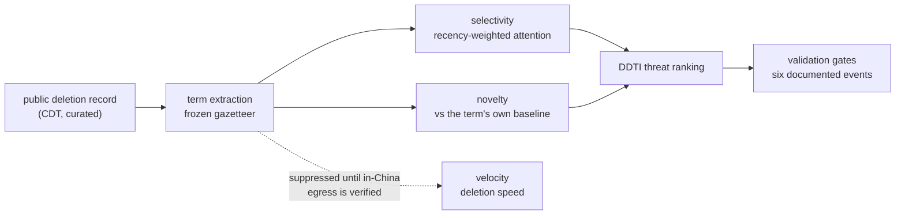

# Methodology — the Deletion-Differential Threat Index (DDTI)

Palimpsest measures censorship by treating the censor as a sensor. This document explains
the method, the math, and — most importantly — exactly what each number does and does not
mean. Honesty about scope is a feature: a censorship-measurement tool that overclaims is
worse than useless, because people make safety decisions on its output.

## 1. The core idea

A censored post carries two pieces of information: *that* it was deleted, and *what* it was
about. Aggregated over many posts, these reconstruct the censor's revealed priorities — the
topics the apparatus spends effort suppressing, how that effort shifts, and how fast it
moves. The DDTI decomposes this into three legs.



### Selectivity — *what is being targeted*

For each candidate term, selectivity is the recency-weighted volume of censor attention it
draws:

```
attention(term) = Σ over recent deletions carrying the term of  0.5 ** (age_days / half_life)
```

A deletion that happened today counts fully; one a half-life ago counts half. The default
half-life is short (2 days) for the live velocity leg and longer (14 days) for the slower
CDT editorial feed, because the two sources move at different tempos.

> **Honest scope.** China Digital Times gives a *numerator* (censored items) without a
> *denominator* (all items on a topic). So selectivity as computed here is **censor-attention
> allocation**, not a true deletion *rate*. A true rate requires dividing by topic volume —
> e.g. the same term's frequency in a trending-topics stream. The code marks this explicitly
> (`scope: "censor_attention_allocation (numerator-only; not a true deletion rate)"`), and
> the upgrade path is documented in `processors/ddti_index.py`.

### Novelty — *what is newly sensitive*

A term that has *never* been sensitive and suddenly is, is far more interesting than one that
is chronically censored. Novelty captures the burst:

```
is_new   = the term had zero baseline-window occurrences and appears now
novelty  = 1.0                         if is_new
         = excess / (1 + excess)       otherwise, where excess = max(0, burst_ratio − 1)
burst_ratio = recent_rate / baseline_rate
```

`is_new` is only asserted against *persisted* history across runs, so a cold start does not
spuriously stamp everything as new.

### Velocity — *how fast it is being contained*

Velocity is deletion speed: the survival curve of a post after it is published. Zhu et al.
(2013) found Chinese deletions are heavily front-loaded (≈30% within 30 minutes, ≈90% within
24 hours) and long-tailed, so Palimpsest reports **cumulative percentiles** (fraction deleted
within each time bucket), never a mean or median.

> **The velocity gap.** Minute-resolution velocity requires observing posts *from inside the
> firewall* — the relevant feeds are walled to foreign traffic. This is the one leg Palimpsest
> cannot fully run from open egress today, and closing it is the core of the planned work.
> Until then, velocity ships only where directly observed,
> and the index says so rather than guessing.

## 2. Combining the legs

The headline threat score amplifies attention by novelty:

```
threat(term) = attention · (1 + novelty_weight · novelty)
```

This is multiplicative by design: a term needs *some* volume before novelty matters, which
keeps the index calm and resistant to single-post noise. The trade-off (a purely additive
form is more sensitive to brand-new low-volume canaries, but noisier) is documented at the
`combine_threat()` tuning point in code, so a reviewer can see the choice and change it.

## 3. Cross-signal: containment vs blackout

A domestic deletion stream alone cannot tell whether a topic is globally consequential or
merely a local sensitivity. Palimpsest triangulates against GDELT's open global-media volume
(`collectors/gdelt_cross_signal.py`):

| Reading | Domestic | Global | Interpretation |
| --- | --- | --- | --- |
| **Containment** | heavily censored | loud | The state is actively suppressing a story the world is already reporting. High confidence. |
| **Blackout** | conspicuously absent | loud | Suppression by *silence* — the cleanest censorship leaves no deletion to count, only a hole. |
| **Domestic-only** | present | quiet abroad | A local sensitivity; weight accordingly. |

Containment requires *both* sides to fire (global salience × a bounded domestic-attention
factor), so neither alone produces a false positive. If GDELT is unreachable the term is
scored as an explicit **abstention**, never a false zero.

### Event lens — visibility, framing, and withdrawal are different claims

For a declared current event, Palimpsest joins the public Weibo hot-search title
archive across headline revisions before interpreting an exit. The event definition
requires both reviewed geography and disaster-context terms; a model does not discover
the event or decide whether it was censored at publication time.

The lens keeps three observations separate:

1. **Permitted visibility:** matching headlines reached the curated board, with exact
   dates and best observed ranks.
2. **State-pinned framing:** linked headlines occupied the board's editorially pinned
   slot. This is selected attention, not neutral popularity.
3. **Withdrawal watch:** an exact headline left after one observed day. A later matching
   event headline resolves that flag as headline continuity; without a deletion trail,
   an unresolved exit remains a review trigger rather than proof of a takedown.

This means a changing casualty count cannot manufacture censorship by changing the
headline string. High and continuing visibility can contradict a topic-level blackout
reading, but it does not prove that discussion was uncensored. Headline casualty figures
remain unverified source text, not Palimpsest estimates.

The China Brief also applies the same evidence grammar automatically to leading
headline clusters on the latest board day. This automatic layer is intentionally
narrower than the declared lens:

- it folds contextual Arabic/full-width/Chinese counts, then uses conservative
  containment and character-trigram similarity;
- current headlines seed clusters, while historical rows may enrich but never bridge
  two current clusters;
- it reports permitted visibility, deterministic pin overlap, withdrawal continuity,
  and DDTI overlap as separate fields; a DDTI overlap can set a current label only
  when its own bound source clock is fresh;
- optional newswire context matches Chinese headline text only and cannot determine the
  censorship label;
- stale, abstaining, malformed, or internally incomplete board input produces
  **unavailable**, never a quiet or no-blackout reading.

Automatic cards may therefore say **visible permitted attention**, **state-pinned
framing**, **DDTI overlap**, or **withdrawal watch unconfirmed**. They may not assert a
takedown, blackout, neutral popularity, or uncensored discussion. The machine artifact
publishes a bounded ranked set; the China Brief renders its leading cards and links the
full JSON.

### Piece-level censorship-practice dossiers

The event lens answers what a public attention surface did around a current
event. It does not by itself answer whether a particular post or article was
removed. The censorship-practice dossier layer makes that item-level boundary
explicit:

- a documented social tombstone is an observed disappearance, but not an
  automatic finding about cause or actor;
- a public ledger or CDT item is attributed reporting, and the reporting
  article is not represented as itself removed;
- `suppressed_invisible` is a topic-level permitted-attention pattern;
- `withdrawal_watch` remains `review_required` without an exact post URL and
  independent removal evidence;
- ordinary edits, visible results, `no_baseline`, unreachable archives, and
  unmatched CDX transitions remain counted exclusions.

Cross-piece joins use exact public URL or stable social observation identity
only. DDTI joins an article only through an exact retained sample URL.
UNDERTEXT is labeled as a derived projection rather than independent
corroboration. Actor attribution remains `not_established` unless the retained
evidence explicitly names the CCP, a PRC authority, a platform, a local
authority, or another actor in a relationship to the reported action. An
attributed actor carries its reported role; an entity appearing only in tags
does not qualify. The complete contract is documented in
`docs/CENSORSHIP-PRACTICE-DOSSIERS.md`.

## 4. Term extraction

Terms come from three deterministic, auditable sources, unioned (`extract_terms()`):
1. CDT's own editorial `<category>` tags (a free, curated topic signal);
2. quoted/bracketed entity spans in headlines (`《…》`, `「…」`, `"…"`) — the censored term itself;
3. substring matches against the **154-term Chinese censorship gazetteer**
   (`config/zh_censorship_gazetteer.json`) and a small canonical English entity list.

Matching is substring-based (never `\b`, which does not anchor on CJK). No statistical NER
model is used for the sensitive layer — it is kept small and human-auditable on purpose
(see §6).

## 5. Discovering new vocabulary

Because the censor's vocabulary mutates faster than any hand-maintained list, Palimpsest mines
the deletion stream for *candidate* new euphemisms (`processors/gazetteer_evolution.py`). A
candidate is proposed only when it (a) recurs across multiple independent deletions and (b)
reliably co-occurs with already-known sensitive content:

```
association = sens_support / total_support          # how reliably it travels with known terms
score       = association · log1p(sens_support)     # reward strong association AND repetition
```

CJK text is sliced into character n-grams (no segmenter in the stdlib) so a short coinage is
recovered from inside a longer span. The output is an **advisory ledger for human ratification**
— the engine never edits the gazetteer itself.

## 6. Why the sensitive layer is human-authored

The deletion-notice classifier patterns and the censorship gazetteer are authored directly and
never delegated to a language model aligned with Beijing, because such a model will quietly omit
the most sensitive terms — exactly the ones that matter most. That asymmetric failure mode is
designed around on purpose. An optional LLM step exists only to *draft an English gloss* for a
human to confirm, never to decide what is sensitive.

## 7. Stated biases

Every figure ships with its biases stated openly:
- **Source bias.** CDT is editorial and English-fronted; FreeWeibo/GreatFire archives carry
  their own selection slant; diaspora feeds carry diaspora priorities. None is a neutral census.
- **Numerator-only selectivity** (see §1) — attention allocation, not a deletion rate.
- **Survivorship.** The cleanest censorship leaves nothing to observe; absence (blackout) is
  inferred, not measured directly, and is flagged as such.
- **Decade-old baselines** (Zhu et al. 2013; Bamman et al. 2012) are re-measured, never assumed.

## References

- Zhu, T., Phipps, D., Pridgen, A., Crandall, J. R., & Wallach, D. S. (2013). *The Velocity of
  Censorship: High-Fidelity Detection of Microblog Post Deletions.* USENIX Security.
- Bamman, D., O'Connor, B., & Smith, N. A. (2012). *Censorship and Deletion Practices in Chinese
  Social Media.* First Monday.
- King, G., Pan, J., & Roberts, M. E. (2013). *How Censorship in China Allows Government Criticism
  but Silences Collective Expression.* American Political Science Review.
